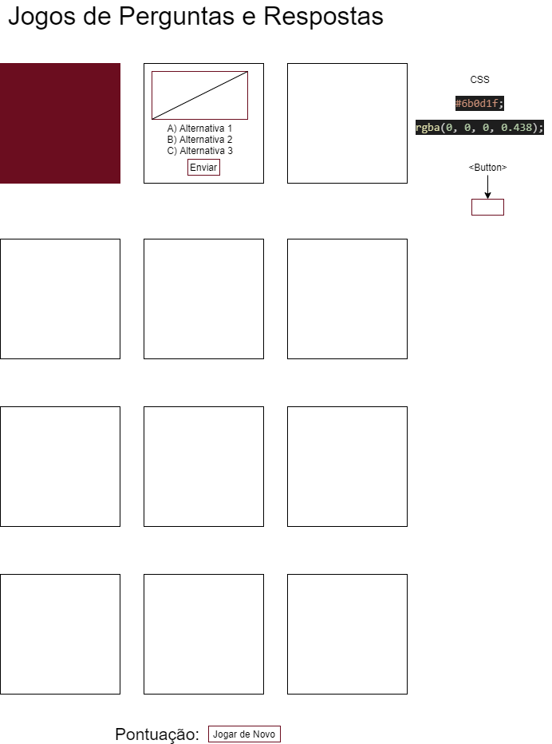
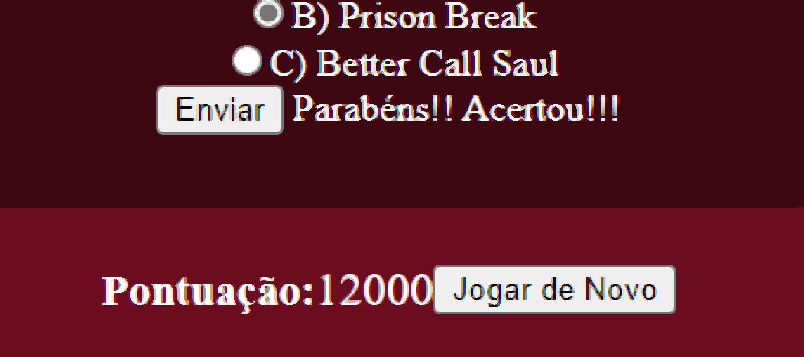

# Projeto Quiz LIMA
Trabalho individual de LIMA, para fechamento do primeiro semestre do curso de desenvolvimento de sistemas do SENAI. 

## Wireframe
O Wireframe deste projeto considera não apenas computadores pessoais, mas também dispositivos móveis, veja abaixo a imagem do Wireframe.

## Leia o Manual do Jogo 

Link do Repositório: https://github.com/jorgesousadev/quiz

Link do Jogo: https://jorgesousadev.github.io/quiz/jogo.html

Quando acessar o link citado acima, o jogador terá que escolher a alternativa correta de cada questão e clicar no botão chamado "enviar".

Exemplo: Na primeira questão, escolha uma alternativa e depois clique em enviar , se acertar vai aparecer isso que mostra a imagem abaixo.
Vai receber essa mensagem: "Parabéns!! Acertou!!!"

E também vai ganhar 1000 pontos pela questão acertada.

Se o jogador errar a questão, vai receber essa mensagem: "Errou!!! Quem sabe na próxima vez!!!"

Depois de responder a primeira questão, faça o mesmo na segunda questão e sucessivamente.

Se o jogador quiser tentar acertar as perguntas a partir do início, basta ir até o final da página e clicar no botão "Jogar de Novo", e a pontuação e as alternativas marcadas irão ser apagadas e o jogador poderá jogar de novo.

A pontuação máxima que pode alcançar no jogo é 12000 pontos, sendo que uma questão acertada vale 1000 pontos.

